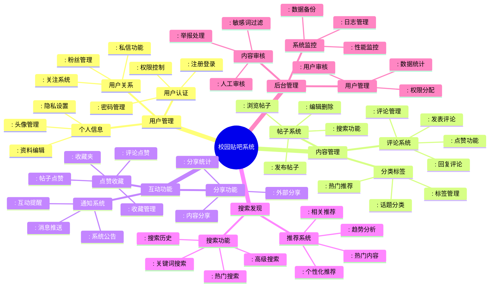
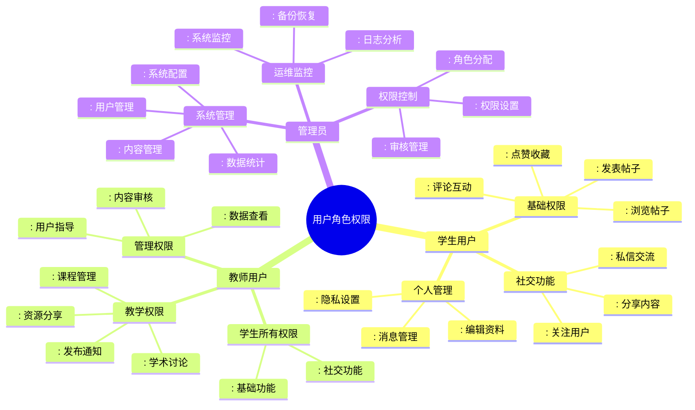
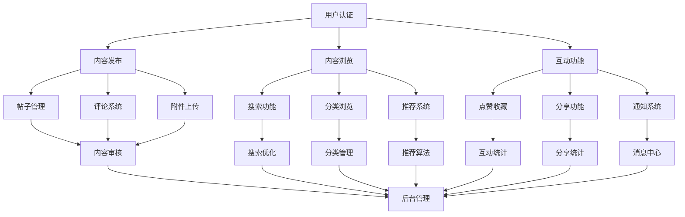
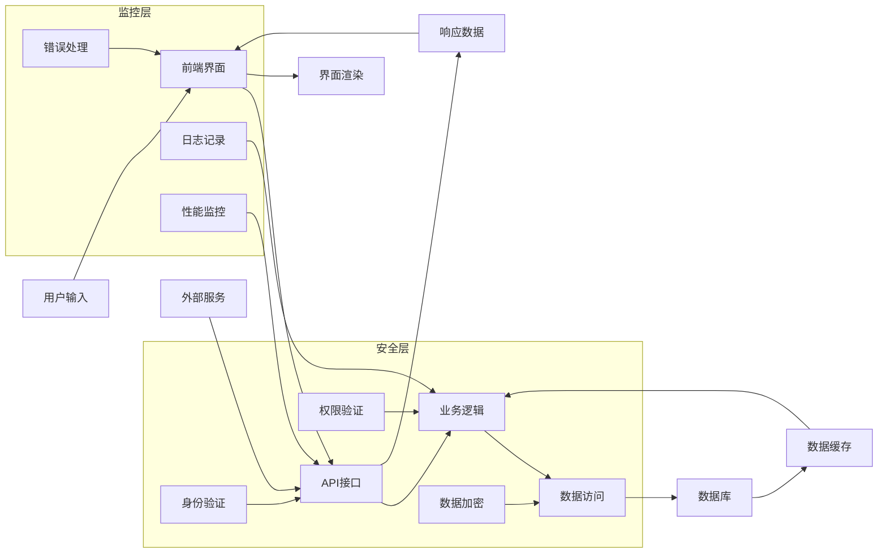
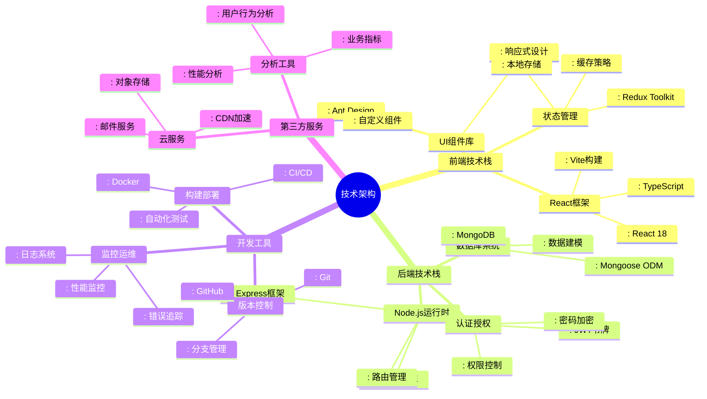
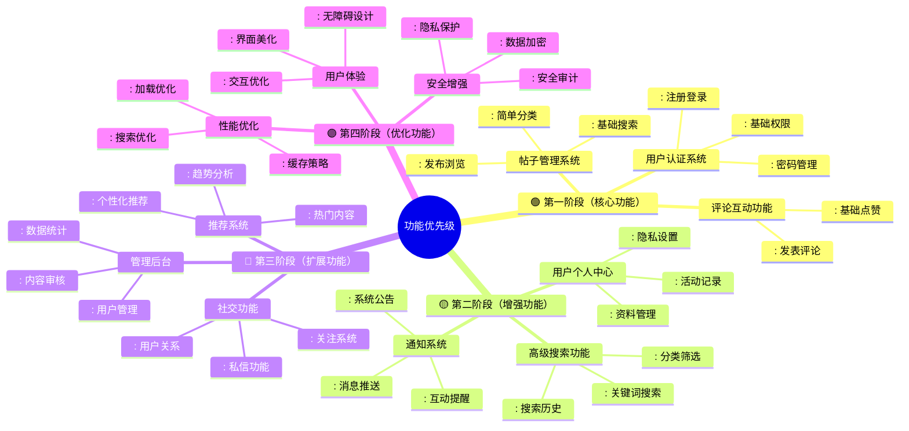

# 校园贴吧系统 - 产品脑图

## 系统整体架构脑图

## 用户角色权限脑图

## 功能模块交互脑图

## 数据流脑图

## 技术架构脑图

## 产品功能优先级脑图

## 使用说明

这些脑图可以帮助你：

1. **整体理解系统架构** - 通过mindmap了解各模块关系
2. **功能优先级规划** - 根据颜色标识确定开发顺序
3. **技术选型参考** - 明确前后端技术栈选择
4. **交互流程设计** - 通过流程图理解数据流向
5. **权限管理设计** - 清晰定义不同用户角色的权限

你可以将这些脑图作为项目开发的参考指南，确保开发过程有条不紊地进行。